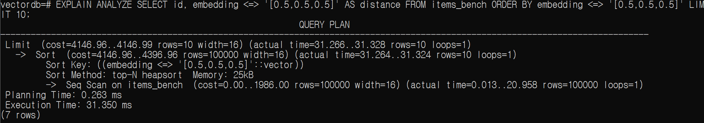
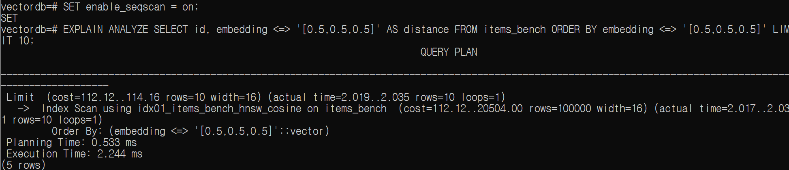
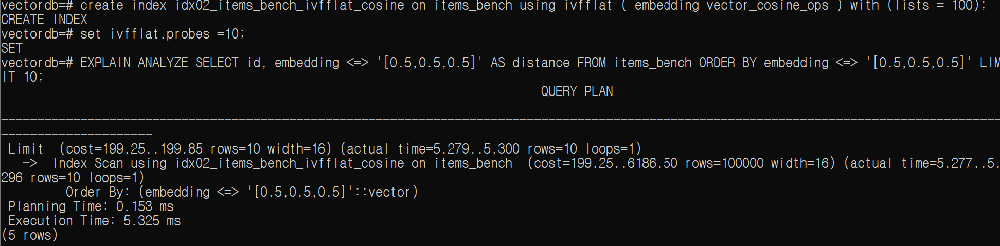

# pgvector Lab

PostgreSQL + pgvector를 이용한 벡터 저장, 유사도 검색, 인덱스 및 검색 성능 실습

## Phase 1 상태 — 완료

PostgreSQL에 벡터 데이터 저장 → L2/Cosine 유사도 검색 → HNSW/IVFFlat ANN 인덱스 적용 → 100,000건 벡터 데이터 기준 검색 성능 비교 수행.

## 진행 항목

- [x] PostgreSQL + pgvector 실습 환경 구성
- [x] `vector` Extension 활성화
- [x] `vector` 컬럼을 가진 테이블 생성
- [x] 샘플 벡터 데이터 저장
- [x] 기본 Vector Similarity Search 실행
- [x] L2 Distance와 Cosine Distance 비교
- [x] HNSW 인덱스 생성 및 검색
- [x] IVFFlat 인덱스 생성 및 검색
- [x] 인덱스 유무에 따른 검색 성능 비교

## 1. pgvector 활성화

```sql
CREATE EXTENSION vector;
```

설치 확인:

```sql
SELECT extname, extversion FROM pg_extension WHERE extname = 'vector';
```

실습 환경 기준 pgvector `0.8.6` 설치 확인.

## 2. Vector 테이블 생성

```sql
CREATE TABLE items (id bigserial PRIMARY KEY, name text, embedding vector(3));
```

`vector(3)` = 각 행에 3차원 벡터 저장.

## 3. 샘플 Vector 데이터 저장

```sql
INSERT INTO items (name, embedding) VALUES ('apple', '[1,0,0]');
INSERT INTO items (name, embedding) VALUES ('banana', '[0.9,0.1,0]');
INSERT INTO items (name, embedding) VALUES ('car', '[0,0,1]');
INSERT INTO items (name, embedding) VALUES ('big_apple', '[10,0,0]');
```

`big_apple`은 `apple`과 같은 방향을 가리키지만 벡터 크기는 의도적으로 크게 설정.
L2 Distance와 Cosine Distance 차이 확인 목적.

## 4. L2 Distance

```text
<-> = L2 (Euclidean) Distance
```

```sql
SELECT name, embedding <-> '[1,0,0]' AS l2_distance FROM items ORDER BY embedding <-> '[1,0,0]';
```

L2 Distance = 벡터 사이의 실제 기하학적 거리 측정.
벡터 크기가 결과에 영향.
`[1,0,0]`과 `[10,0,0]`의 L2 Distance = `9`.

## 5. Cosine Distance

```text
<=> = Cosine Distance
```

```sql
SELECT name, embedding <=> '[1,0,0]' AS cosine_distance FROM items ORDER BY embedding <=> '[1,0,0]';
```

```text
Cosine Distance = 1 - Cosine Similarity
```

- Cosine Distance `0` = 같은 방향
- Cosine Distance `1` = 직각 방향
- Cosine Distance `2` = 반대 방향

`[1,0,0]`과 `[10,0,0]`은 크기는 다르지만 같은 방향이므로 Cosine Distance = `0`.

## 6. 기본 Vector Similarity Search

Top-K 벡터 검색 = Query Vector와 각 벡터 사이의 거리 계산 → 가까운 순서 정렬 → 상위 K개 행 반환.

```sql
SELECT name, embedding, embedding <=> '[1,0,0]' AS distance FROM items ORDER BY embedding <=> '[1,0,0]' LIMIT 2;
```

핵심 패턴:

```sql
ORDER BY embedding <=> query_vector LIMIT K
```

특정 거리 이하 데이터만 검색 가능.

```sql
SELECT name, embedding <=> '[1,0,0]' AS distance FROM items WHERE embedding <=> '[1,0,0]' < 0.1 ORDER BY embedding <=> '[1,0,0]';
```

## 7. HNSW 인덱스

HNSW = 벡터 데이터에서 가까운 이웃을 빠르게 찾기 위한 ANN(Approximate Nearest Neighbor) 인덱스.
벡터를 그래프 형태의 이웃 관계로 연결하고, 검색 시 가능성이 높은 이웃을 따라가며 후보 탐색.

### 거리별 Operator Class

| 거리 기준 | Operator | HNSW Operator Class |
|---|---|---|
| L2 | `<->` | `vector_l2_ops` |
| Inner Product | `<#>` | `vector_ip_ops` |
| Cosine | `<=>` | `vector_cosine_ops` |
| L1 | `<+>` | `vector_l1_ops` |

이번 실습에서는 Cosine과 L2 중심으로 확인.

```sql
CREATE INDEX item_embedding_hnsw_cosine_idx ON items USING hnsw (embedding vector_cosine_ops);
CREATE INDEX item_embedding_hnsw_l2_idx ON items USING hnsw (embedding vector_l2_ops);
```

샘플 데이터 4건은 성능 비교에 너무 작으므로 인덱스가 실제 검색 경로로 사용되는지만 확인 후 대용량 성능 실험으로 이동.

확인한 실행 경로:

```text
Index Scan using item_embedding_hnsw_cosine_idx
Order By: (embedding <=> '[1,0,0]'::vector)
```

```text
Index Scan using item_embedding_hnsw_l2_idx
Order By: (embedding <-> '[1,0,0]'::vector)
```

## 8. IVFFlat 인덱스

IVFFlat 역시 ANN 벡터 인덱스.
HNSW처럼 그래프를 탐색하는 대신 벡터 공간을 여러 List로 분할하고 일부 List를 선택하여 검색.

```text
전체 Vector
    ↓
여러 List로 분할
    ↓
Query Vector
    ↓
선택된 List 검색
    ↓
Top-K 반환
```

### `lists`와 `probes`

```text
lists  = 벡터 공간을 나누는 List 개수
probes = 한 번의 검색에서 확인할 List 개수
```

```sql
CREATE INDEX item_embedding_ivfflat_cosine_idx ON items USING ivfflat (embedding vector_cosine_ops) WITH (lists = 2);
CREATE INDEX item_embedding_ivfflat_l2_idx ON items USING ivfflat (embedding vector_l2_ops) WITH (lists = 2);
```

```sql
SET ivfflat.probes = 1;
```

`ivfflat.probes` = Query마다 몇 개의 IVFFlat List를 검색할지 결정.

```text
lists = 2, probes = 1
→ 벡터 공간을 2개의 List로 분할
→ Query마다 그중 1개의 List 검색
```

### HNSW vs IVFFlat

| | HNSW | IVFFlat |
|---|---|---|
| 검색 방식 | 이웃 그래프 탐색 | 선택된 Vector List 탐색 |
| 구조 | Graph | Lists / Clusters |
| ANN | Yes | Yes |
| 주요 검색 조정값 | `ef_search` | `probes` |
| 주요 생성/구조 조정값 | Graph 관련 Parameter | `lists` |

## 9. 검색 성능 비교 — 100,000 Vectors

4건의 샘플 데이터로 기능 확인 후, 100,000개의 랜덤 벡터를 가진 별도 테이블 생성.
PostgreSQL Planner의 실행 경로를 강제로 변경하지 않은 상태에서 검색 성능 측정.

### 100,000건 테스트 데이터 생성

```sql
CREATE TABLE items_bench (id bigserial PRIMARY KEY, embedding vector(3));
```

```sql
INSERT INTO items_bench (embedding) SELECT ARRAY[random(), random(), random()]::vector FROM generate_series(1,100000);
```

```sql
SELECT count(*) FROM items_bench;
```

예상 Row 수: `100000`

### 실험 순서

```text
100,000 rows
      ↓
No Index 측정
      ↓
HNSW 생성 → 측정
      ↓
HNSW 삭제
      ↓
IVFFlat 생성 → 측정
```

모든 테스트에서 동일한 Cosine Top-K Query 사용.

```sql
EXPLAIN ANALYZE SELECT id, embedding <=> '[0.5,0.5,0.5]' AS distance FROM items_bench ORDER BY embedding <=> '[0.5,0.5,0.5]' LIMIT 10;
```

실험 조건:

- 데이터: 100,000건 랜덤 `vector(3)`
- 거리 기준: Cosine Distance (`<=>`)
- Query Vector: `[0.5,0.5,0.5]`
- Top-K: 10
- IVFFlat: `lists = 100`, `probes = 10`

### No Index

```text
Seq Scan on items_bench (100,000 rows)
    ↓
top-N heapsort
    ↓
LIMIT 10
Execution Time: 31.350 ms
```



### HNSW

```sql
CREATE INDEX idx01_items_bench_hnsw_cosine ON items_bench USING hnsw (embedding vector_cosine_ops);
```

```text
Index Scan using idx01_items_bench_hnsw_cosine
    ↓
LIMIT 10
Execution Time: 2.244 ms
```



### IVFFlat

HNSW 측정 후 HNSW 인덱스 삭제 → IVFFlat 테스트.

```sql
DROP INDEX idx01_items_bench_hnsw_cosine;
```

```sql
CREATE INDEX idx02_items_bench_ivfflat_cosine ON items_bench USING ivfflat (embedding vector_cosine_ops) WITH (lists = 100);
```

```sql
SET ivfflat.probes = 10;
```

```text
Index Scan using idx02_items_bench_ivfflat_cosine
    ↓
LIMIT 10
Execution Time: 5.325 ms
```



### 결과

| 검색 방식 | 실행 경로 | Execution Time | No Index 대비 |
|---|---|---:|---:|
| No Index | Seq Scan + top-N heapsort | 31.350 ms | 1.0x |
| HNSW | HNSW Index Scan | 2.244 ms | 약 14.0배 빠름 |
| IVFFlat (`lists=100`, `probes=10`) | IVFFlat Index Scan | 5.325 ms | 약 5.9배 빠름 |

이번 실험 조건에서 두 ANN 인덱스 모두 No Index 전체 Scan보다 Top-K 검색 시간 감소.
HNSW가 100,000건·3차원 벡터 테스트 조건에서 가장 빠른 결과 기록.

단, 해당 결과는 이번 실험 환경 기준.
벡터 차원, 데이터 수, 하드웨어, ANN Parameter에 따라 결과 차이 발생 가능.

## 핵심 정리

```text
PostgreSQL + pgvector
        ↓
Vector 데이터 저장
        ↓
거리 기준 선택
   ├─ L2
   └─ Cosine
        ↓
Top-K Similarity Search
        ↓
대용량 검색을 위한 ANN Index
   ├─ HNSW
   └─ IVFFlat
        ↓
Execution Plan과 실행 시간으로 검증
```

Phase 1을 통해 PostgreSQL의 벡터 저장, 벡터 간 유사도 검색, ANN 인덱스를 이용한 Top-K 검색 가속 방식 직접 확인.

이 Vector Similarity Search가 **Phase 2 RAG의 Retrieval 기반**.

## Next — Phase 2: RAG

pgvector를 Retrieval 계층으로 사용하여 DB 운영 문서 / Runbook 기반의 작은 RAG Pipeline 구현.
